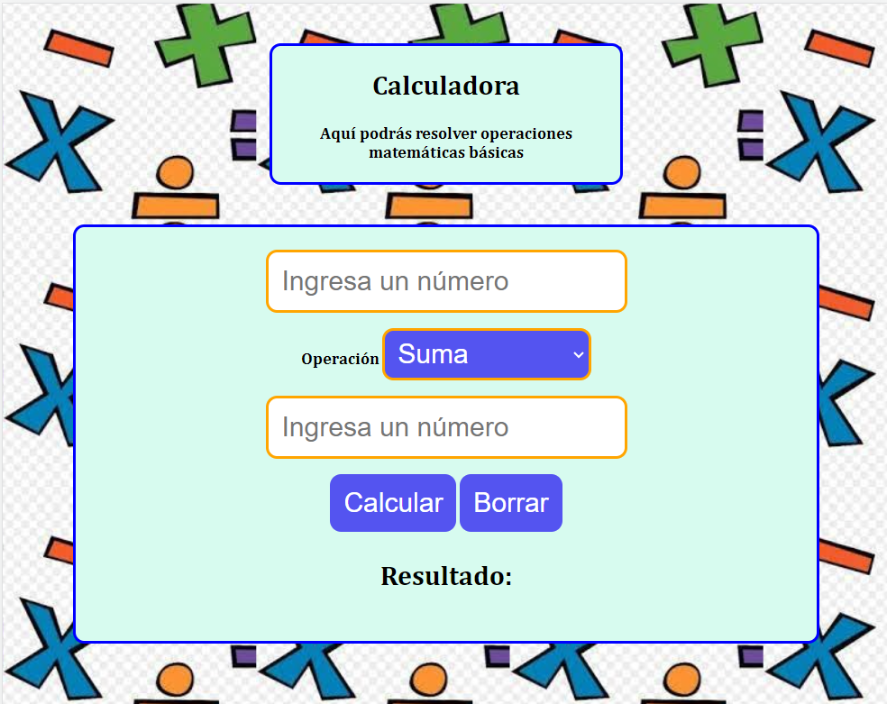

# CALCULADORA SIMPLE

Este proyecto integra HTML, CSS Y JavaScript. 
Aquí podrás resolver operaciones básicas tales como: 
   .SUMA 
   .RESTA
   .MULTIPLICACIÓN
   .DIVISIÓN

##Cómo correr la aplicación _"Calculadora"_?

Para ejecutar esta aplicación, simplemente necesita clonar el proyecto y ejecutar el archivo html.
Sino, accede directamente desde el siguiente link:
               https://vale-78.github.io/Calculadora/

This site was built using [GitHub Pages](https://vale-78.github.io/Calculadora/).

##Impresión de pantalla

##contriciones

Cualquier tipo de aportes son bienvenidos.

    1-(Fork) Bifurque el repositorio en GitHub.
    2-(Clone)Clone el proyecto en su propia máquina.
    3-(Commit)Confirmar cambios en la rama de desarrollo.
    4-(Push)Empuje su trabajo de regreso a su tenedor.
    5-(Pull request)Envíe una solicitud de extracción para que pueda revisar sus cambios